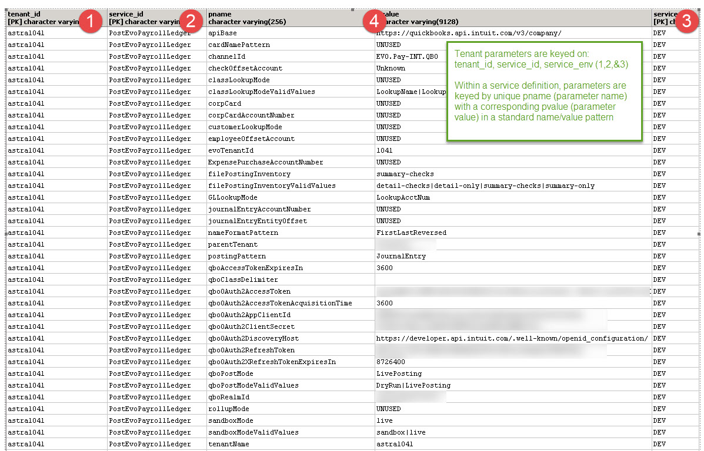
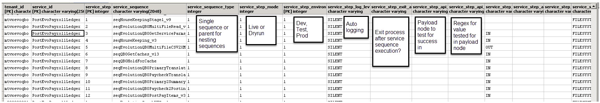

# wso2_integrator_multi_tenant
Multi-tenant integration for WSO2 Enterprise Integrator driven by database parameters and orchestration linkage

Note-DDL is for Postgres. Syntax may need to change for your preferred database.

